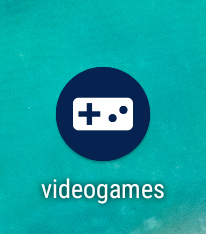
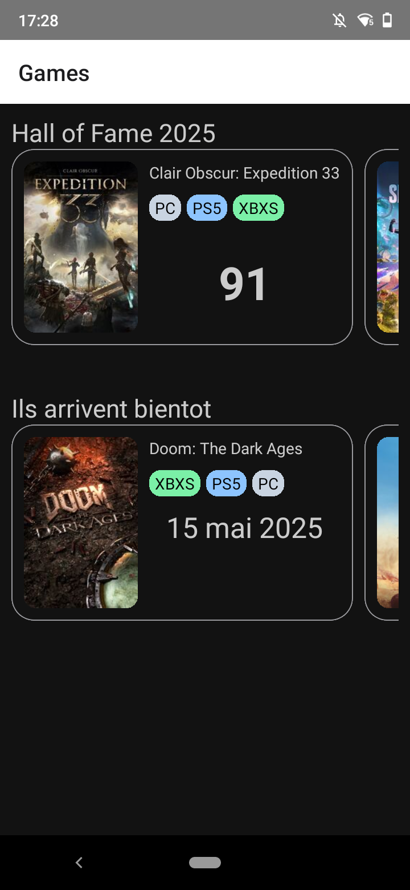
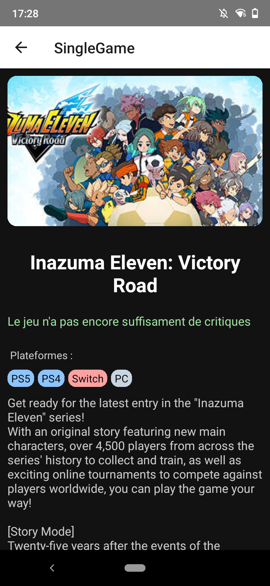

# Videogames - Application Mobile de Jeux

## Description du Projet
Cette application mobile permet de consulter depuis l'API de OpenCritique la liste des jeux à venir et les jeux faisant partie du Hall of Fame de l'année courante. 

En cliquant sur un jeux vous pouvez retrouver plus d'information sur celui-ci.

## Technologies Utilisées
- React Native
- JavaScript
- React Navigation
- React Native bootsplash

## APIs Utilisées
- OpenCritic par RapidAPI
> [OpenCritic](https://opencritic.com) , à ne pas Confondre avec MetaCritic, est un agregateur de reviews et notes données aux jeux vidéos.
> OpenCritic collecte ses données de par des centaines de publications, blogs et chaines de press en un seul endroit.
> OpenCritic est 100% financé par son audience et ne dépend d'aucun organisme exterieur.
> Pour plus d'infomations sur le fonctionnement de OpenCritic, je vous invite à consulter leur page [FAQ](https://opencritic.com/faq)

Clée d'API OpenCritic
~~~text
eaa77dc7a4msh031b69194d6e49bp13a3edjsna2cb89562b37
~~~
cléf gratuite d'authentification de l'API d'OpenCritic par RapidAPI
elle est à mettre dans le fichier ``.env`` sous la variable d'environnement :
- ``API_KEY``

Vous pouvez aussi en générer une vous même en passant directement par la page de [RapidAPI](https://rapidapi.com/opencritic-opencritic-default/api/opencritic-api/playground/apiendpoint_3eb6cbf3-25cf-4cfc-ba70-4fe91d6d78e9) 

## Lancement de l'Application

### Prérequis :

- ``npm``
- ``yarn`` #optionnel
- ``nodejs``
- ``android studio``

Ici ``Java 21`` est utilisé

### Installation
```bash
npm install
# OU
yarn 
```

#### Pour Android :
```bash
npm run android
# OU
yarn android
```
## Screenshots
Si tout à fonctionné vous devriez voir ceci : 


